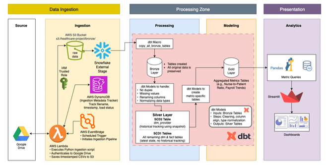
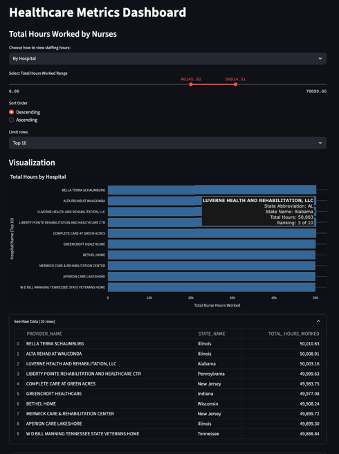
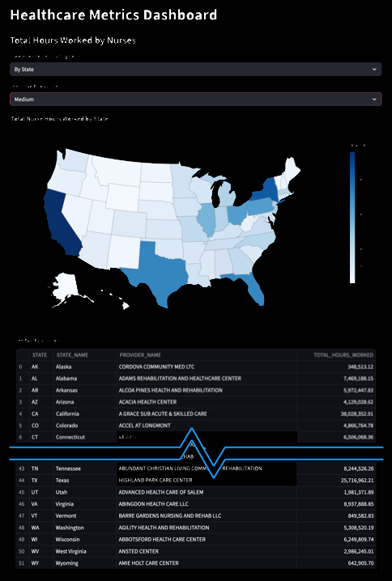
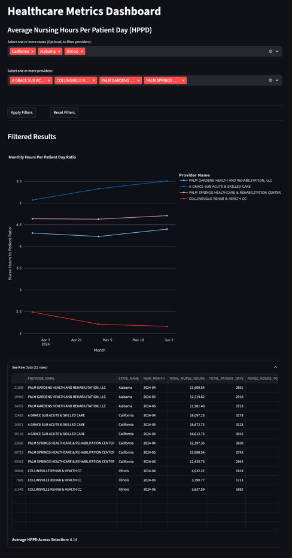

# Healthcare Data Engineering Project

## 🔍 Overview

This project analyzes U.S. nursing home staffing and quality metrics using modern data engineering practices. It combines real-world CMS datasets, cloud infrastructure, dbt transformations, and an interactive Streamlit dashboard to surface insights that support better patient outcomes, staffing management, and operational efficiency.

## 📊 Project Architecture

[](./assets/images/full/Healthcare_Project_Architecture.png)

(Click image to open a full sized image)

- **Data Sources:** 15+ raw CMS CSV files from Google Drive
- **Ingestion Pipeline:**
  - AWS Lambda to incrementally move files from Google Drive → S3
  - DynamoDB used for ingestion metadata tracking
  - AWS EventBridge used to automatically execute AWS Lambda script on a schedule
- **Bronze Layer:** Raw data loaded from S3 to Snowflake using dbt macro (`copy_all_bronze_tables`)
- **Silver Layer:** dbt models for cleaned fact/dim tables (SCD1/SCD2 handling)
- **Gold Layer:** dbt models that calculate 10 KPIs across staffing, quality, cost, and throughput
- **Reporting:** Streamlit dashboard with interactive filters, charts (Plotly), and dark/light themes

## 📄 Data Dictionary  
A full description of all original columns and data types is available in [`references/NH_Data_Dictionary.pdf`](./references/NH_Data_Dictionary.pdf)

## 📓 KPIs Tracked

1. Total Hours Worked (State & Month)
2. Average Nurse-to-Patient Ratio (HPPD)
3. Percentage of Contractor Staffing
4. Nurse Overtime Hours (Proxy: Contractor %)
5. Nurse Turnover by State
6. COVID-19 Staff Vaccination Rates
7. Patient Throughput (MDS Census Proxy)
8. Readmission Rates Within 30 Days (by Diagnosis)
9. Provider Quality Rating Trends
10. Incident Counts (Falls, Infections, etc.)

## 💡 Project Structure
```bash
.
├── dbt_healthcare/         # dbt models and macros (separate repo, link below)
├── streamlit_dashboard/    # Streamlit app and visualization code
├── ingestion/              # Python + Lambda scripts for ingesting from Google Drive
├── rawdata/                # Raw CMS CSVs (local copy)
├── analysis/               # Text-based profiling of incoming datasets
├── worksheets/             # Snowflake SQL exports (used to create Gold models)
├── assets/                 # Architecture diagram and ERD (PDF and drawio)
├── Project_Documentation/  # Project summary, data dictionary, screenshots
├── README.md               # This file
```
- 📁 [`dbt_healthcare`](https://github.com/kindlerl/healthcare_metrics_dbt) — dbt models, snapshots, and tests used for transforming raw data into Silver and Gold layers.

## 🔗 How to Run the Dashboard Locally

```bash
# 1. Clone the repo
$ git clone https://github.com/your-username/healthcare-project.git
$ cd healthcare-project

# 2. (Optional) Create a virtual environment
$ python -m venv venv
$ source venv/bin/activate  # or venv\Scripts\activate on Windows

# 3. Install dependencies
$ pip install -r requirements.txt

# 4. Run the Streamlit app
$ streamlit run streamlit_dashboard/app.py
```

## 📊 Sample Visuals from Streamlit Dashboard
| Visualization | Preview (click for full size) |
|---------------|-------------------------------|
| Total Hours Worked by Nurses, by Hospital | [](./assets/images/full/KPI_Total_Hours_Worked_by_Nurses_by_Hospital.png) |
| Total Hours Worked by Nurses by State | [](./assets/images/full/KPI_Total_Hours_Worked_by_Nurses_by_State.png) |
| Average Nurse Hours Per Patient Day (HPPD) | [](./assets/images/full/KPI_Average_Nursing_Hours_Per_Patient_Day_HPPD.png) |

## 🔎 Insights from the Data

See the [`project_summary.md`](./project_summary.md) file for a detailed explanation of each question below:

- What is the relationship between nurse staffing and hospital occupancy?
- Which hospitals have the highest overtime hours for nurses?
- What are the average staffing levels by state and hospital type?
- What trends can you identify in patient length of stay over time?

## 🚀 Tech Stack

- **Google Drive API** for source data access
- **AWS S3 + Lambda + DynamoDB + AWS EventBridge** for ingestion and tracking
- **Snowflake** as cloud data warehouse
- **dbt** for transformation, testing, and layering
- **Streamlit + Plotly** for final reporting/dashboarding

## 🔆 Deliverables
- End-to-end source code for the Healthcare Data Pipeline
- Entity Relationship Diagram
- Data modeling logic implemented with dbt
- Visualizations and insights generated via Streamlit
- A detailed [Project Summary](./project_summary.md) highlighting key findings

> Note: Private deliverables such as the project walkthrough video and internal documentation have been shared separately.

---

> Built as part of a portfolio data engineering project. This project simulates an end-to-end healthcare data pipeline using real-world public datasets.

