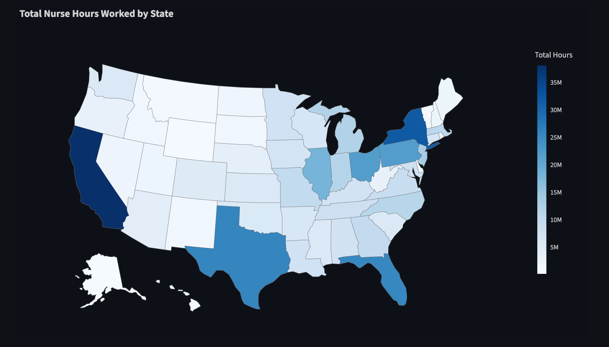

# Project Summary: Healthcare Metrics Data Pipeline

## 🔍 Overview

This document provides detailed answers and data-driven insights related to the four key questions posed by the project:

1. What is the relationship between nurse staffing and hospital occupancy?
2. Which hospitals have the highest overtime hours for nurses?
3. What are the average staffing levels by state and hospital type?
4. What trends can you identify in patient length of stay over time?

> [!NOTE]
> Each insight is backed by analysis from transformed datasets modeled via dbt, visualized in Streamlit, and aggregated using Snowflake SQL.

---

## ❓ 1. Relationship Between Nurse Staffing and Hospital Occupancy

Restated – “When more patients are present, do facilities increase staffing accordingly? Or does patient volume outpace staffing?  Or vice-versa?”

Patient-level occupancy or capacity fields were unavailable.  As a result, **nurse hours per patient day (HPPD)** was used as a key proxy to understand how staffing responded to patient volume.  A facility-level analysis of **HPPD** revealed variation in how providers adjusted staffing relative to changes in patient volume.

[See associated visualization](./assets/images/full/observation1_hppd.png)

- Some providers, like *Meadow View Health and Rehabilitation* showed a **consistent decline** in patient days across three months, but only reduced nurse hours after the second month — suggesting a lagging staffing adjustment in response to occupancy drops.

- Other providers, like *Parkview Care Center* showed a **brief dip in HPPD in May followed by a partial recovery in June**, indicating a moderate and timely adjustment in staffing as patient volume changed.

- In contrast, *Lutheran Life Villages* maintained a **stable staffing alignment**, with HPPD fluctuating less than ±5% from a 3-month average of 3.77 — implying either **consistent occupancy patterns or deliberate staffing stability**.

> Together, these cases highlight the operational complexity of aligning nurse staffing to fluctuating patient volume and underscore the importance of tracking HPPD to identify where mismatches may occur.

---

## ❓ 2. Which Hospitals Have the Highest Overtime Hours?

Overtime hours were estimated using a standard healthcare analytics proxy metric:

```text
% Overtime = Contractor Nurse Hours / (Employee + Contractor Nurse Hours)
```

- This industry-accepted proxy reflects how heavily a provider relies on **contract staff**, often used to supplement short-staffed shifts.
- Over **50 facilities recorded 100% contractor usage**
- More than **350 facilities recored contractor usage exceeding 60%**.
- These high ratios likely indicate staffing shortages and higher operational costs due to dependence on contingent labor.

> While not literal overtime from timecards, this ratio reveals real stress on core staffing models and financial implications.

---

## ❓ 3. Average Staffing Levels by State and Hospital Type



Due to a lack of explicit "hospital type" data (e.g., urban vs rural), this analysis focused on **average nurse hours per patient day (HPPD)** by **U.S. state and region**.

- **California** led all states in total nurse hours, pushing the **West region** to the highest average HPPD (4.30).
- **Midwest, South, and Northeast** states averaged around 3.75–3.79 HPPD.
- **Puerto Rico** had an even higher average (5.20) but reflects a small facility count.

> State-level differences may reflect policy, staffing mandates, or population-driven facility scale. The consistent clustering in most regions suggests baseline national staffing stability.

---

## ❓ 4. Trends in Patient Length of Stay

While individual length-of-stay (LOS) metrics were not present, **monthly total patient days** per provider offered a useful macro-level trend indicator.

- Some facilities showed steady or declining patient days, with staffing levels adjusting accordingly.
- Others maintained flat patient volume but had unaligned staffing adjustments, suggesting other operational dynamics at play.

> Monitoring total patient days over time provides insight into facility throughput and supports better decisions around bed management, staffing, and discharge planning while maintaining a positive patient exerience.

---

## 💡 Summary

This project demonstrates how a cloud-native data pipeline can surface actionable insights using public healthcare datasets. With thoughtfully modeled transformations, consistent proxy metrics, and interactive reporting, real-world analysis on staffing, cost control, and operational trends produced actionable observations for this industry.

